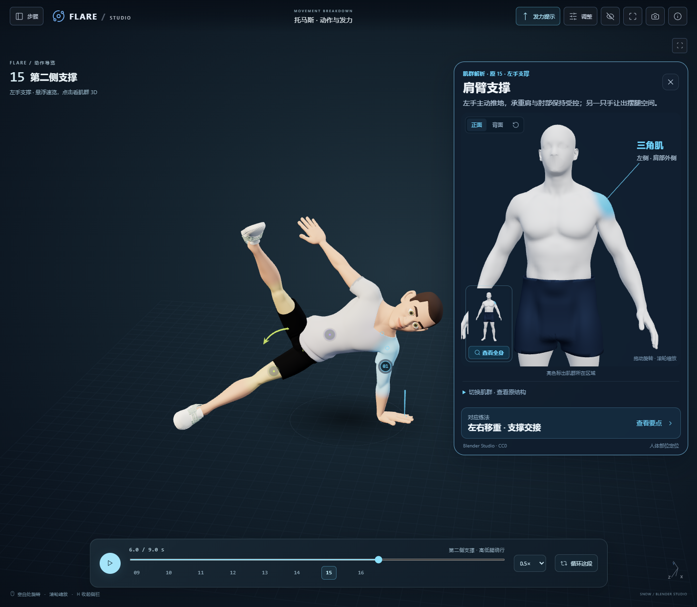

# 2026-10-07 当前交付证据

这组文件是从原机器 `output/fitness-reference-20261007/` 复制的最终证据，供 GitHub 接手使用。未重新生成或改变检查事实；本地完整记录与历史失败画面继续保留。时间字段为原始 UTC，展示日期采用 Asia/Shanghai。

| 文件 | 核对范围 |
| --- | --- |
| [ui-shoulder-final.png](ui-shoulder-final.png) | 最终真实 WebGL 页面，原 15 / 6 秒，完整人体与左侧三角肌，包含主动画和原播放器 |
| [ui-mobile-final.png](ui-mobile-final.png) | 390×844 响应式视口，关闭、肌群定位与固定训练入口；不是实机触屏测试 |
| [portrait.png](portrait.png) | 本地 Blender 实际渲染，当前光滑低细节人偶脸 |
| [final-verification.json](final-verification.json) | 原动作字节哈希、阶段1页面导出一致、源资产保持、最终模型与构建文档一致 |
| [surface-context-checks.json](surface-context-checks.json) | 实际 GLTFLoader 与 8 项表面/资源诊断，13组×左右26次，399个原肌肉资源保护 |
| [ui-verification.json](ui-verification.json) | 默认3热点/0常驻卡片，独立旋转时原动画时间与热点变换保持，布局/切换与零错误警告 |
| [checks.json](checks.json) | 最终制作来源、坐标、闭合体表、服装、眼睛省略与原文件哈希记录 |

当前 GLB 为 `public/anatomy/fitness-reference.glb`：2 网格、81,002 三角面，SHA-256 `47b9427d19d82cb4f573196028e1513c20b719c41a2a5fd961579360412f442d`。制作元数据的顶点数是 Blender 作者网格计数；GLB 导出会在 UV/法线接缝拆分顶点，实际加载计数较大，不能混为一个数值。

截图显示功能所在区域，不是肌肉精确边界或激活数值。Node 检查不替代 GPU，Blender 渲染不替代浏览器交互；本轮结果不代表第二阶段已获用户审美验收。代码和文档交接见 [项目交接](../../handoff-2026-10-07.md)，当前与历史视觉范围见 [design-qa.md](../../../design-qa.md)。

图示来源：动作人物 Snow Rig © Blender Foundation，CC BY 4.0；静态人物 Blender Studio Human Base Meshes，CC0，本项目已适配；具体署名与修改见 [运行资产署名](../../../public/anatomy/ATTRIBUTION.md) 和 [Snow 署名](../../../public/coach/ATTRIBUTION.md)。

